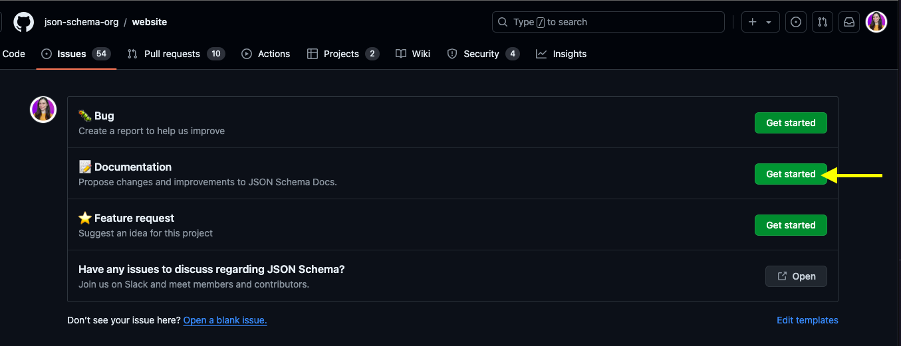

## Welcome

Welcome to the JSON Schema Contributing Guide, and thank you for your interest. 

This guide will help you get started with the basics of our documentation working processes. 

## Ground rules

Before working on any contribution, we ask our members to [read our Code of Conduct](../contributions/code-of-conduct) to learn more about our values, behavioral expectations, standards, and rules. 

## Before you start

To contribute to the JSON Schema documentation you will need to complete the following steps:

1. [Create a GitHub account](https://docs.github.com/en/get-started/start-your-journey/creating-an-account-on-github#signing-up-for-a-new-personal-account), if you don't have one already. 
2. Read and agree to our Code of Conduct. 
3. [Install Node.js v20.9.0+](https://nodejs.org/en/download/package-manager). 
4. [Set up environment variables](https://github.com/json-schema-org/website?tab=readme-ov-file#setup-enviroment-variables), like yarn.

## Community engagement

To stay updated with news about the JSON Schema project and its documentation, engage with our team, ask questions, and discuss ideas, please [join our Slack workspace](https://json-schema.org/slack) and the following channels: 

**#documentation**: Discuss anything related to the JSON Schema documentation. 

**#community-announcements**: Announce events related to the JSON Schema project and share updates. 

**#anouncements**: This is reserved to announcements from the JSON Schema organization. 

**#website**: Discuss things related to our website. 

**#introductions**: Introduce yourself to the community and get to know other members. 

To learn about what our readers are discussing and their questions about the JSON Schema, we recommend joining the **#stack-overflow** channel, which contains Stack overflow questions tagged with JSON Schema.  
  

## Best practices

This is a list of best practices the JSON Schema project strives and resources we recommend for additional information:

1. Markdown syntax: Use this [Markdown cheat sheet](https://www.markdownguide.org/cheat-sheet/) for a wuick reference. 
2. File naming conventions: We use dashes instead of spaces, and lowercase letters to name .md files. For example: **contributing-guide.md**
3. Commit messages: We recommend reading this comprehensive [step-by-step guide on how to write good commit messages on Git](https://www.freecodecamp.org/news/how-to-write-better-git-commit-messages/). 
4. Style guide: We follow the [Google developer documentation style guide](https://developers.google.com/style). 

## Contribution workflow 
We value documentation and appreciate efforts to help us improve our documents. There are two ways you can contribute to improve our documentation:

1. Work on an existing issue. 
2. Propose changes. 

### Work on an existing issue

To work on an existing issue, go to the [JSON Schema docs board](https://github.com/orgs/json-schema-org/projects/16), where you will find all the open issues related to documentation. 

If the issue you select has no asignees, you can claim the issue by leaving a comment on it and tagging @benjagm who will asignt the issue to you. 

If the issue you select has an asignee already, express your interest in collaborating and tag the asignee instead in the comment. The JSON Schema respects the order in which people claim issues, therefore, you will have to check if the asignee is accepting collaborations.

After you have been assigned to an issue, [fork the json-schema-org/website repository](https://github.com/json-schema-org/website) and create a new branch to work on your changes. 

### Propose changes

To propose modifications to our documentation, we invite you to first  review our [documentation board](https://github.com/orgs/json-schema-org/projects/16) and make sure no issue has been created for the changes you're proposing. 
  
  If no issue exists, you can [create a GitHub issue](https://docs.github.com/en/issues/tracking-your-work-with-issues/creating-an-issue#creating-an-issue-from-a-repository) and select the *Documentation* template. After you create the issue, you can decide whether you want to work on it yourself or let someone else claim it. For working on the issue yourself, tag @benjagm in the comment so he assigns you to it. To work on the changes.
  

## Create a Pull Request

To work on your changes, fork the [json-schema-org/website repository](https://github.com/json-schema-org/website) and create a new branch. Use dashes (-) instead of spaces when naming your branch. When your changes are ready for review, open a pull request to the main branch, and add the issue your pull request solves. Add @benjagm as reviewers and leave a comment asking for a review. 

After your pull request is reviewed by the community and is approved, you will merge your changes into the main branch and your contribution to the project will be complete!

We created this guide based on templates from [The Good Docs Project](https://www.thegooddocsproject.dev/).

 