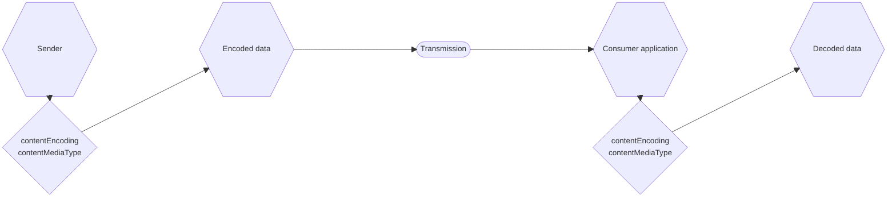

<Keywords label="single: non-JSON data single: media"/>

<Star label="New in draft 7" />

JSON schema has a set of [keywords](../../learn/glossary#keyword) to describe and optionally validate non-JSON data stored inside JSON strings. Due to the difficulty in writing validators for all media types, JSON schema validators are not required to validate the contents of JSON strings based on these keywords. However, applications that consume validated JSON use these keywords to encode and decode data during the storage and transmission of media types.

<Keywords label="single: contentMediaType single: media; contentMediaType" />

## contentMediaType and contentEncoding

The `contentMediaType` keyword specifies the media type of the content of a string, as described in [RFC 2046](https://tools.ietf.org/html/rfc2046). The Internet Assigned Numbers Authority (IANA) has officially registered [a comprehensive list of media types](http://www.iana.org/assignments/media-types/media-types.xhtml), but the set of supported types depends on the application and operating system. Mozilla Developer Network maintains a [shorter list of media types that are important for the web](https://developer.mozilla.org/en-US/docs/Web/HTTP/Basics_of_HTTP/MIME_types/Complete_list_of_MIME_types)

### Example 

The following schema specifies a string containing an HTML file using the document's default encoding.

```json
// props { "isSchema": true }
{
  "type": "string",
  "contentMediaType": "text/html"
}
```
```json
// props { "indent": true, "valid": true }
"<!DOCTYPE html><html xmlns=\"http://www.w3.org/1999/xhtml\"><head></head></html>"
```

<Keywords label="single: contentEncoding single: media; contentEncoding" />


The `contentEncoding` keyword specifies the encoding used to store the contents, as specified in [RFC 2054, part 6.1](https://tools.ietf.org/html/rfc2045) and [RFC 4648](https://datatracker.ietf.org/doc/html/rfc4648).

The acceptable values are the following:
- `quoted-printable`
- `base16` 
- `base32` 
- `base64` 
 
If not specified, the encoding is the same as the containing JSON document.

There are two main scenarios:

1. **Same encoding as JSON document**: Leave `contentEncoding` unspecified and include the content in a string as-is. This is suitable for text-based content types (e.g., `text/html`, `application/xml`) and assumes UTF-8 encoding in most cases.
2. **Binary data**: Set `contentEncoding` to `base64` and encode the content using Base64. This is appropriate for binary content types such as images (`image/png`) or audio files (`audio/mpeg`).


### Example

The following schema indicates that a string contains a PNG file and is encoded using Base64:

```json
// props { "isSchema": true }
{
  "type": "string",
  "contentEncoding": "base64",
  "contentMediaType": "image/png"
}
```
```json
// props { "indent": true, "valid": true }
"iVBORw0KGgoAAAANSUhEUgAAABgAAAAYCAYAAADgdz34AAAABmJLR0QA/wD/AP+gvaeTAAAA..."
```

To better understand how `contentEncoding` and `contentMediaType` are applied in practice, let's consider the process of transmitting non-JSON data:

<!--

-->



1. The sender encodes the content, using `contentEncoding` to specify the encoding method (e.g., base64) and `contentMediaType` to indicate the media type of the original content.
2. The encoded data is then transmitted.
3. Upon receiving the data, the consumer application uses the `contentEncoding` and `contentMediaType` information to select the appropriate decoding method.
4. Finally, the consumer application decodes the data, restoring it to its original form.

This process ensures that the non-JSON content is properly encoded for transmission and accurately decoded by the recipient, maintaining the integrity of the data throughout the process.

<Keywords label="single: contentSchema single: media; contentSchema" />

## contentSchema
<Star label="New in draft 2019-09" />

The value of `contentSchema` must be a valid JSON schema that you can use to define the structure and constraints of the content. It is used in conjunction with `contentMediaType` when the instance is a string. If `contentMediaType` is absent, the value of `contentSchema` is ignored. 

## Full example

The following schema indicates that a string contains a JSON object encoded using Base64:

```json
// props { "isSchema": true }
{
    "$schema": "https://json-schema.org/draft/2020-12/schema",
    "type": "object",
    "properties": {
        "data": {
            "type": "string",
            "contentMediaType": "application/json",
            "contentEncoding": "base64",
            "contentSchema": {
                "type": "object",
                "properties": {
                    "name": {
                        "type": "string"
                    },
                    "age": {
                        "type": "integer"
                    }
                },
                "required": ["name", "age"]
            }
        }
    }
}
```
```json
// props { "indent": true, "valid": true }
"eyJuYW1lIjoiSm9obiBEb2UiLCJ0b21lIjoiMjUifQ=="
```

```json
// props { "indent": true, "valid": true }
{
  "name": "John Doe",
  "age": 25
}
```
